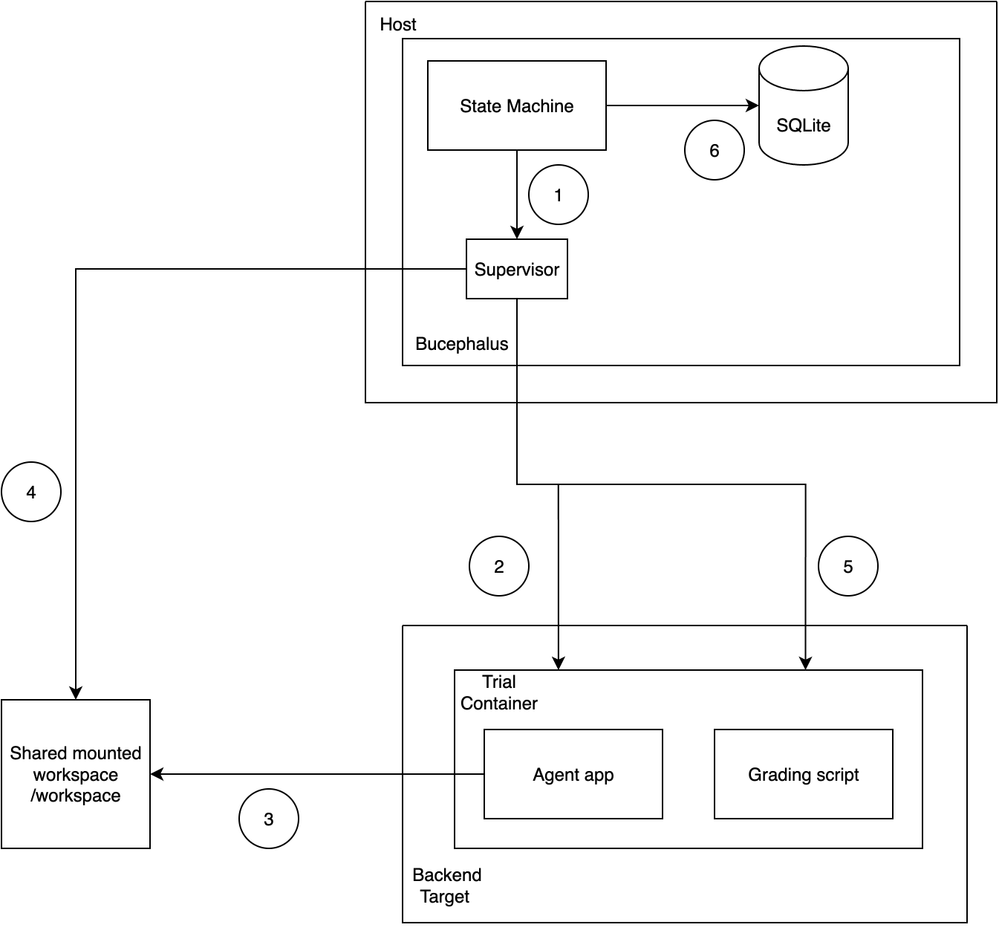

# AgentLab

A command-line workbench for experimenting with agents

[Demo](#) · [Walkthrough](#) · [Docs](docs/user/index.md) · [Architecture](docs/specs/ARCHITECTURE.md) · [Concepts](docs/user/concepts.md)

> **Placeholder** — screenshot or GIF of `lab run` and `lab views` here.

**Built with:** Rust · Tokio · Docker · SQLite · DuckDB · ratatui

---

## Why I built this

I built this because I wanted to be able to benchmark and evaluate my agent applications, but 
I found that I really wanted to AB test different prompts, different models and different implementations. 

I also wanted built-in retries, recoverability and durability for long-running experiments. 


## What it does

- **Declarative experiments.** One YAML file describes variants, cases, the
  stage chain, grading, and metrics.
- **Sealed, content-addressed packages.** `lab build` resolves an experiment
  and freezes it into a package identified by a SHA-256 digest. Same digest,
  same experiment — every time.
- **Isolated containerized trials.** Each trial runs in its own Docker (or
  Modal) sandbox with an explicit filesystem and network contract.
- **Durable execution.** `pause`, `resume`, `kill`, `recover`, and `continue`
  operate on persisted state. A crashed run reconciles from disk and resumes at
  the next uncommitted slot, with exactly-once result publication.


## How it works

An experiment flows through four stages, then a fixed build-to-inspect
lifecycle:

```
  Cases  ─────►  Stages  ─────►  Grading  ─────►  Analysis
  what to        how the         per-trial        cross-trial
  evaluate       agent runs      scoring          comparison

  lab build  ─►  lab check-package  ─►  lab preflight  ─►  lab run  ─►  lab views
  seal +         static package        dynamic launch      isolated     query the
  digest         hygiene               readiness           trials       results
```

`build` resolves the YAML and seals a package. `check-package` runs static
hygiene checks; `preflight` checks dynamic launch readiness (images, grader
reachability, env bindings). `run` schedules trials one slot at a time, each in
its own sandbox, grades them, and commits results. `views` and `query` read
them back. A package must pass a real end-to-end smoke test before a full run
is allowed.

See [Concepts](docs/user/concepts.md) for the noun model and
[Architecture](docs/specs/ARCHITECTURE.md) for the runner internals.




## Install

`lab` is a single binary. Build and install it with Cargo:

```bash
cargo install --path .
```

This puts `lab` on your PATH. Verify:

```bash
lab --help
```

You also need Docker or OrbStack running — trials execute in containers.

## Quickstart

```bash
# build a sealed package from an experiment
lab build experiment.yaml --out .lab/builds/demo --json

# static checks, then dynamic launch readiness
lab check-package .lab/builds/demo --json
lab preflight .lab/builds/demo --json

# smoke-test one case per variant, then the full run
lab run .lab/builds/demo --smoke-test --materialize full --json
lab run .lab/builds/demo --materialize full --json
```

Result inspection (`lab views`, `lab query`) is a separate local-only
analytics build — see [Distribution](docs/distribution.md).

Full walkthrough: [Quickstart](docs/user/quickstart.md).

## Repo map

```
rust/crates/
  lab-cli/         The `lab` binary — command parsing and the operator surface
  lab-runner/      Build, scheduling, trial execution, persistence, Docker/Modal transport
  lab-core/        Shared domain types and the in-container agent contract
  lab-analysis/    DuckDB-backed views and the SQL query surface
  lab-schemas/     Versioned JSON Schemas, compiled into the binary
  lab-provenance/  Content addressing, digests, and run attestations
schemas/           JSON Schemas for every artifact written to disk
docs/user/         Product docs — YAML reference, concepts, authoring guides
docs/specs/        Architecture notes and design history
```

## Roadmap

- Programmatic builder API alongside YAML authoring
- Backend-native sidecar support for Modal
- Finer-grained per-trial resource scheduling
- Kubernetes compute backend and OTel trace export

## License

MIT — see [LICENSE](LICENSE).
